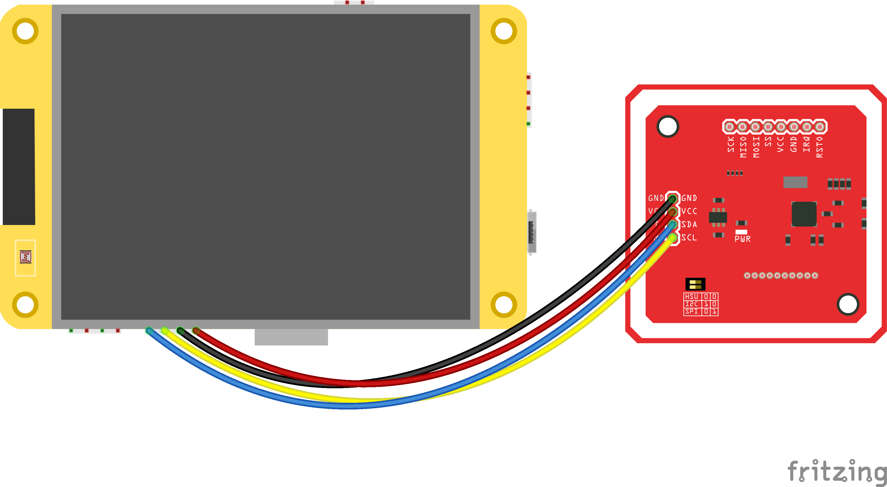

<div align="center">


### cryptnox-pos

Standalone USDC payment terminal powered by a Cryptnox smart card and the Cheap Yellow Display

</div>

<br/>
<br/>

[-blue.svg)](https://github.com/witnessmenow/ESP32-Cheap-Yellow-Display)
[](https://docs.espressif.com/projects/esp-idf/en/v5.5/)
[](https://github.com/embarquech/cryptnox-sdk-esp32)
[](https://www.gnu.org/licenses/lgpl-3.0)

`cryptnox-pos` is a self-contained payment terminal firmware that runs on the
ESP32-2432S028 "Cheap Yellow Display" (CYD). It also serves as a reference
**dev kit** showing how to integrate the [`cryptnox-sdk-esp32`](https://github.com/embarquech/cryptnox-sdk-esp32)
into a real-world end-user product.

The user selects a USDC amount on the touchscreen, taps a **Cryptnox smart
card** on the attached PN532 reader, and the terminal signs and broadcasts an
EIP-1559 transfer on Ethereum Sepolia via a JSON-RPC endpoint (PublicNode by
default), then waits for the on-chain receipt before showing **Approved**.

> [!WARNING]
> **Reference / educational dev kit — not a tamper-resistant terminal.**
> The ESP32 is not a secure microcontroller and has no protected RAM. The
> optional [secure build](#secure-build)
> (Flash Encryption + encrypted NVS + Secure Boot v2) protects secrets at rest
> and locks the boot chain, but at run time the card PIN (entered on-screen, not
> stored in the firmware) and the Wi-Fi password live in plaintext RAM —
> readable by anyone who can reach live memory (JTAG, a run-time exploit).
> **The Cryptnox Hardware Wallet remains the trust anchor** — private keys never
> leave the card, so a compromised ESP32 still cannot sign without it.

### Built on

- **[`cryptnox-sdk-esp32`](https://github.com/embarquech/cryptnox-sdk-esp32)** (git submodule) — secure channel, ECDH/ECDSA, PN532 transport, ESP32 crypto provider
- **[LVGL 8](https://lvgl.io/)** (managed component) — the touchscreen UI
- **[TFT_eSPI](https://github.com/Bodmer/TFT_eSPI)** + **[XPT2046_Touchscreen](https://github.com/PaulStoffregen/XPT2046_Touchscreen)** (git submodules) — CYD panel driver + touch, behind LVGL
- **[arduino-esp32](https://github.com/espressif/arduino-esp32)** as an ESP-IDF managed component (Arduino runtime for the display libraries; the rest stays on native IDF)

---

## Supported hardware

### Cryptnox Hardware Wallet smart cards

Works with Cryptnox Hardware Wallet smart cards running firmware v1.6.0 or later.

| Smart card | Wallet version |
|------|---------------|
| [Crypto Hardware Wallet – Dual Card Set](https://shop.cryptnox.com/product/hardware-wallet-smartcard-dual/) | v1.6.1 |

### NFC readers

| Reader | Type | Interface |
|--------|------|-----------|
| [PN532 NFC Module](https://www.nxp.com/products/PN532) | Contactless (NFC/ISO 14443) | I²C |

### Host board

| Board | MCU | Display | Touch |
|-------|-----|---------|-------|
| [ESP32-2432S028 "Cheap Yellow Display"](https://github.com/witnessmenow/ESP32-Cheap-Yellow-Display) | ESP32-WROOM-32 | ILI9341 240×320 (portrait) | XPT2046 (resistive) |

---

## Installation

1. Install **[ESP-IDF v5.5](https://docs.espressif.com/projects/esp-idf/en/v5.5/esp32/get-started/index.html)**
   (the project pulls `espressif/arduino-esp32` and `lvgl/lvgl` as IDF managed
   components; TFT_eSPI / XPT2046 are in-tree submodules).
2. Clone this repository **with submodules**:
   ```
   git clone --recursive https://github.com/embarquech/cryptnox-pos.git
   cd cryptnox-pos
   ```
3. Copy the credentials template and fill it in:
   ```
   cp config.template.h main/config.h
   ```
   `main/config.h` is gitignored — see [Configuration](#configuration) below.
4. Set the target, then build and flash from an ESP-IDF environment:
   ```
   idf.py set-target esp32
   idf.py -p PORT build flash monitor
   ```
   The first build also fetches `espressif/arduino-esp32` and `lvgl/lvgl` from
   the IDF component registry, so expect a longer initial compile.

> [!TIP]
> Open the IDF env first: on Windows run the "ESP-IDF PowerShell"/`export.bat`,
> on macOS/Linux `. $IDF_PATH/export.sh`. For the **secure (encrypted/signed)
> build**, see [Secure build](#secure-build)
> below — don't use plain `idf.py flash` on an already-provisioned board.

## Hardware setup

> [!CAUTION]
> Always double-check the wiring before powering the board to prevent damage.

The CYD exposes its free GPIOs on the **CN1** header. The firmware uses
the **I²C** interface to the PN532.

### CYD CN1 ↔ PN532 NFC — I²C interface

| PN532 Pin | CYD Pin / Label  | Wire Color |
|-----------|------------------|------------|
| GND       | GND              | Black      |
| VCC       | 3.3V             | Red        |
| SDA       | GPIO 27 (CN1 SDA)| Yellow     |
| SCL       | GPIO 22 (CN1 SCL)| Blue       |

> [!IMPORTANT]
> Make sure the switches on the PN532 module are configured for **I²C** mode:
>
> - **Switch 0** → HIGH
> - **Switch 1** → LOW



The display, touchscreen and backlight pins are already wired internally on the
CYD; the firmware drives them through TFT_eSPI's `ILI9341_2_DRIVER` in **portrait
rotation (240×320)**, with `invertDisplay(true)` + a GAMMASET fix for the panel
and a calibrated XPT2046 touch mapping. The backlight is PWM-dimmable (LEDC).

---

## Configuration

`main/config.h` is gitignored. Copy `config.template.h` to `main/config.h`
and fill in:

| Field | Description |
|-------|-------------|
| `RPC_URL` | Ethereum JSON-RPC endpoint (PublicNode Sepolia by default; an Infura variant is provided commented-out) |
| `RPC_PROJECT_ID` / `RPC_API_SECRET` | Optional — only when using Infura (HTTP Basic Auth); leave undefined for PublicNode |
| `RPC_CA_CERT_PEM` | Optional — pin the RPC endpoint's TLS certificate; trusts only that cert instead of the full CA bundle. Undefined = Mozilla bundle |
| `ADDR_FROM` | Ethereum address of the **card** (`m/44'/60'/0'/0/0`) — used to fetch the nonce and validate the ecrecover parity |
| `ADDR_TO` | **Fallback** destination address, used until an operator sets one on the device. **Use the EIP-55 mixed-case checksum form** — the firmware verifies the checksum at boot and refuses to start on a mismatch. All-lowercase is accepted but bypasses that typo protection (and warns at boot) |
| `ADDR_USDC` | **Fallback** USDC ERC-20 contract address on the target chain (Sepolia testnet by default). Same EIP-55 rule as `ADDR_TO` |
| `CHAIN_ID_SEPOLIA`, `MAX_PRIORITY_FEE`, `MAX_FEE`, `GAS_LIMIT_ERC20` | Chain ID and EIP-1559 gas parameters (the fees are first-boot defaults, editable at run time in the settings) |

**Not in `config.h`** — set on the device, never baked into the firmware:
- **Wi-Fi** — chosen during setup from a list the terminal scans, in a browser (stored in NVS).
- **Payout addresses and token contracts** — set during setup, either typed in a
  browser or read off the operator's own Cryptnox card, and accepted on the panel.
  The `config.h` values above are only the fallback; an asset with no address of its
  own is **not offered** on the amount screen.
- **Card PIN** — entered on the touchscreen keypad at sign time, scrubbed from RAM right after.
- **Transfer amount** — chosen on the keypad per transaction.

Setup itself is a browser flow — see [docs/config-portal.md](docs/config-portal.md):

```
 admin code    panel     the one secret that never touches a network
 QR code       panel     camera joins the terminal's AP; the page opens itself
 authorise     both      the browser asks, the panel takes the code
 addresses     browser   typed, or read off a Cryptnox card
 Wi-Fi         browser   picked from the terminal's own scan
 Finish        panel     restarts, which applies everything
```

---

## Secure build

By default the firmware and NVS are **unencrypted and unsigned** — fine for the
dev kit. An optional **secure build** hardens the device on three fronts:

| Feature | Effect |
|---------|--------|
| Flash Encryption | a flash dump is ciphertext, useless without the key |
| Encrypted NVS (`nvs_keys` partition) | the Wi-Fi password / fees in NVS are encrypted |
| Secure Boot v2 (RSA-3072) | only firmware signed with your key boots |

> [!CAUTION]
> These burn **eFuses — IRREVERSIBLE**. Validate on a **sacrificial board
> first**; a misconfigured burn bricks the unit. On the classic **ESP32**
> Secure Boot v2 supports **a single key with no revocation/rotation** (that
> is an S2/S3/C-series feature): if your signing key leaks you cannot revoke
> it, and if you lose it the board can never be updated again. Keep both keys
> **offline, in multiple copies**.

In the repo:
- `sdkconfig.defaults.flash_encryption` — **DEVELOPMENT** secure overlay: Flash
  Encryption (Development mode), `CONFIG_NVS_ENCRYPTION`, Secure Boot v2 +
  signing key, `ESP32_REV_MIN_3` (required for SBv2) and
  `PARTITION_TABLE_OFFSET=0x10000`. Stays reflashable, keeps verbose logs.
- `sdkconfig.defaults.release` — **RELEASE** overlay (layer on top): Flash
  Encryption *Release* mode + boot log off. Locks the board — no plaintext
  flash, no flash dump. Production only, irreversible.
- `partitions.csv` — the `nvs_keys` partition (inert in a normal build).
- `tools/secure_provision.py` — one-shot factory provisioning of a fresh board.
- `tools/secure_flash.py` — pre-encrypt + flash for routine reflashing.

**Step 1 — generate both keys, ONCE per product (store OFFLINE, gitignored):**
```
espsecure.py generate_flash_encryption_key --keylen 256 secure_keys/flash_encryption_key.bin
espsecure.py generate_signing_key --version 2 secure_keys/secure_boot_signing_key.pem
```

**Step 2 — build with the secure overlay** (the bootloader + app are signed
automatically at build time):
```
idf.py -D "SDKCONFIG_DEFAULTS=sdkconfig.defaults;sdkconfig.defaults.flash_encryption" build
```
(PowerShell: quote the whole `-D` argument as shown, because of the `;`.)

**Step 3 — provision a fresh board (one command, IRREVERSIBLE):**
```
python tools/secure_provision.py --port COMx --baud 921600 --yes
```
It checks the board is fresh, burns the flash-encryption key, enables Flash
Encryption, then flashes the signed + pre-encrypted bootloader/table/app. After
it finishes, **reset the board**: the bootloader finalizes Secure Boot on first
boot (burns the public-key digest + `ABS_DONE_1`). Verify:
```
espefuse.py --port COMx summary | findstr "FLASH_CRYPT_CNT ABS_DONE_1"
```
→ `FLASH_CRYPT_CNT` odd and `ABS_DONE_1 = True` = fully hardened.

**Routine reflash afterwards** (board already provisioned, Flash Encryption
active — never use plain `idf.py flash`, it would write plaintext the chip
mis-decrypts):
```
python tools/secure_flash.py --port COMx --baud 921600              # full
python tools/secure_flash.py --port COMx --baud 921600 --app-only   # app only
```
Because images are pre-encrypted on the host, `FLASH_CRYPT_CNT` is never
consumed. To **distribute** an encrypted image instead of flashing locally:
```
python tools/secure_flash.py --package    # -> dist/cryptnox_pos-encrypted-full.bin
```

> [!WARNING]
> Steps 2–3 use the `flash_encryption` overlay = **Development** mode: the board
> stays reflashable with verbose logs while you validate. For the locked
> **production** image, layer the release overlay on top and reflash:
> ```
> idf.py -D "SDKCONFIG_DEFAULTS=sdkconfig.defaults;sdkconfig.defaults.flash_encryption;sdkconfig.defaults.release" build
> ```
> Release mode permanently disables plaintext UART flashing + flash dumps and
> silences the boot log — IRREVERSIBLE, manufacturing only. Note: on the classic
> ESP32 encrypted NVS **requires** Flash Encryption (no HMAC eFuse scheme), so
> the two cannot be separated.

---

## Payment flow

1. **Splash** — Cryptnox logo + spinner while Wi-Fi / SNTP / RPC / wallet come
   up (version shown at the bottom).
2. **Amount** — numeric keypad (cents entry); tap **Charge**.
3. **Send** — Ledger-style review showing the amount, the destination address
   and the USDC contract **in full**; tap **Confirm** or **Cancel**.
4. **PIN** — enter the card PIN on the on-screen keypad (validated, then wiped
   from RAM after signing — never stored).
5. **Transaction** — tap the Cryptnox card on the PN532:
   **Processing** (opening the secure channel) → **Signing** (the card signs
   `keccak256(unsigned_tx)`) → **Authorizing** (recover the `v` parity via the
   `ecrecover` precompile, RLP-encode the EIP-1559 tx, broadcast via
   `eth_sendRawTransaction`) → **Confirming** (poll `eth_getTransactionReceipt`
   until the tx is mined).
6. **Approved / Declined** — Approved **only** on a mined receipt with
   `status 0x1`; tap **New sale** to start the next transfer.

> [!NOTE]
> The card must have a seed loaded and the BIP-32 derivation path
> `m/44'/60'/0'/0/0` available. Provision it once with the
> [Cryptnox CLI](https://github.com/cryptnox/cryptnox-cli):
> ```
> cryptnox initialize
> cryptnox seed generate
> ```

---

## Troubleshooting

- **Inverted colours / banding on gradients** → the CYD panel needs `invertDisplay(true)` (inverted colours) and a GAMMASET tweak (banding/"milky gamma"); both are already applied in `ui_task`. If the screen is blank/scrambled your board may use the other ILI9341 variant — set `CONFIG_TFT_ILI9341_DRIVER=y` (instead of `_2`) in `sdkconfig.defaults` and rebuild.
- **Touch hitboxes are offset** → the raw range used by the XPT2046 driver is calibrated for the panel shipped with the 2432S028. If yours differs, adjust the `map(p.x, 200, 3800, …)` ranges in `main/ui.cpp` (function `touch_to_screen`).
- **`Card not found`** → confirm the PN532 switches are set for I²C, the SDA/SCL wires match GPIO 27/22, and the card is well centred on the antenna.
- **`ecrecover did not match either parity`** → `ADDR_FROM` in `config.h` does not correspond to the card's `m/44'/60'/0'/0/0` derived key. Verify the seed and the path.
- **WiFi connect fails** → only WPA2 is supported; check SSID/password.
- **App partition full** → the project uses two 1.94 MB OTA app slots (`partitions.csv`) on a 4 MB flash, so the budget is half what a single-slot table would give — a "% free" that halved between two builds is almost always that table, not growth. Where the space actually goes, biggest first: the image assets in `.rodata` (`chain_icons.c`, `logo_img.c`, `card_img.c` — ~60 KB between them), then LVGL and the fonts it pulls in. Regenerate an asset smaller (`tools/gen_*.py`) or drop unused fonts (`CONFIG_LV_FONT_MONTSERRAT_*` in `sdkconfig.defaults`); check with `idf.py size-components` before assuming a subsystem is to blame.
- **`Update` says the terminal has no second firmware slot** → that unit was flashed with the old single-app partition table. The table itself is never rewritten by an update, so it needs one reflash over USB first. See [docs/ota.md](docs/ota.md).

---

## Documentation

The generated documentation for this project is available [here](https://embarquech.github.io/cryptnox-pos/).

- [The config portal](docs/config-portal.md) — setup and administration on the terminal's own SoftAP: why that AP is the radio's only interface while the page is up, why the admin code is only ever typed on the panel, and the endpoint list. Test plan: [docs/testing-provisioning.md](docs/testing-provisioning.md).
- [Firmware updates over Wi-Fi](docs/ota.md) — the browser-mediated OTA path, publishing a release, and the signing key you must not ship without. Test plan: [docs/ota-testing.md](docs/ota-testing.md).

---

## License

`cryptnox-pos` is dual-licensed:

- **LGPL-3.0** for open-source projects and proprietary projects that comply with LGPL requirements
- **Commercial license** for projects that require a proprietary license without LGPL obligations

For commercial inquiries, contact: contact@cryptnox.com
